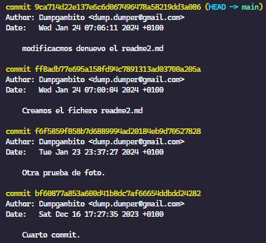
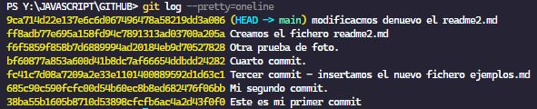
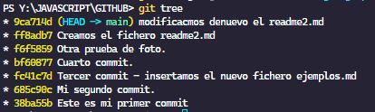
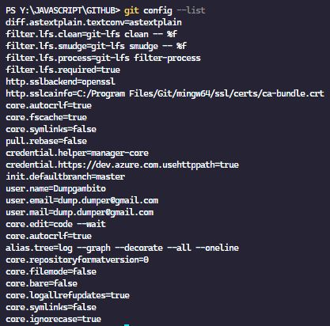
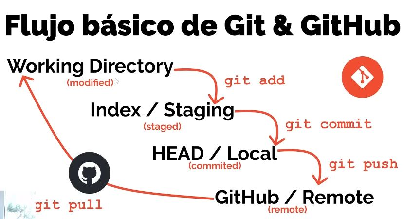
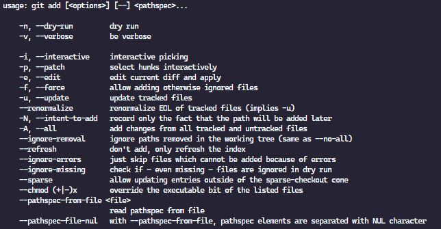
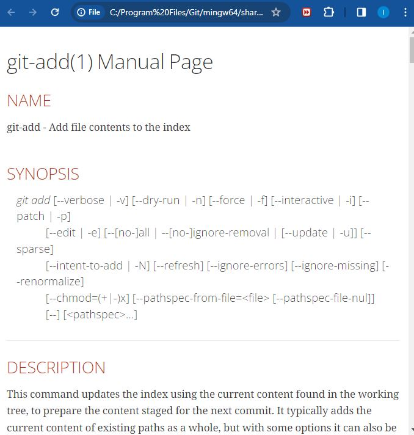
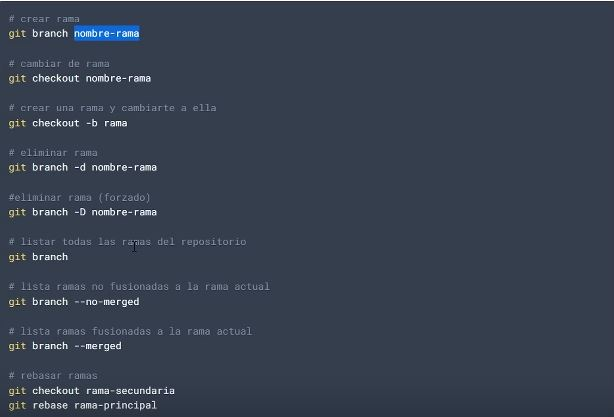

## GITHUB https://www.youtube.com/watch?v=3GymExBkKjE&t=2537s

Punto de retorno : 1:10:36 - parametro diff

- Control de Versiones Distribuidos (DVCS)

### **CONFIGURACION INICIAL**

git config --global user.name "<nombre_usuario>"
git config --global user.email "<email>"

### **1) Empezar el proyecto:**

    git init  -> Crea un carpeta oculta .git donde guarda toda la configuración.

### **2) Cambiar la rama de nombre:**

**_Estando en la rama donde quiere cambiarse el nombre:_**

git branch -m <nombre_nuevo_para_la_rama>

git branch: Este es el comando básico para trabajar con ramas en Git.
-m: Es la opción que se utiliza para cambiar el nombre de la rama.

Otra forma de cambiar el nombre de la rama principal:

```terminal
    git config --global init.defaultBranch <name>
```

### **3) Estado del proyecto:**

git status

### **4. Hacer fotos de ficheros.**

- git add <nombre_del_fichero>
- git add . -> Todos los ficheros ( no es recomendable)

### **5. Salvar foto de los ficheros.**

git commit -m " < mensaje > "

git commit: Este comando se utiliza para confirmar los cambios realizados en el área de preparación y agregarlos al historial de versiones del repositorio.

La opción -m se utiliza para proporcionar un mensaje de confirmación en línea con el comando. El mensaje entre comillas ("Mi primer commit") es un comentario que describe brevemente los cambios realizados en este commit. Es una buena práctica escribir mensajes descriptivos y significativos para que otros desarrolladores (o tú mismo en el futuro) puedan entender fácilmente el propósito del commit.

Cuando se realiza una fotografía, git le asigna un HASH ( código único de identificación).

### **6. Ver los commits realizados:**

#### **_git log_**



#### **_git log --graph_**


#### **_git log --graph --pretty=oneline_**



### **7. Volver a un estado anterior sin haber hecho commit**

git checkout

### **Alias**

```javascript
git config --global alias.<nombreDelAlias> "log --graph --onelilne --decorate --all"
```

1. git --global alias.tree "log --graph --decorate --all --oneline"
2. git tree



### **8.Ignorar ficheros**

Tenemosq que crear un fichero llamado .gitignore y a#adir los ficheros que queremos ignorar.

### **9.Ver lo que ha variado sin hacer la foto**

```javascript
git diff
```

### **10. Mostrar con configuracion**

```javascript
git config --list
```



### **11. Estados de GIT**



## **12. Configurar el origen remoto**

```javascript
git remote add origin https://github.com/Dumpgambito0/learning.git
```

El parametros del comando:

#### ***https://github.com/usuario_github/nombre_repositorio>***

## **13. Subir ficheros a github**

La primera vez:

```script
git push -u origin main
```

Después:

```script
git push
```

## **14. Descargar del remoto el repositorio**

```script
git pull
```

Antes de comenzar en cualquier equipo de trabajo y tirar lineas, lo primero es descargar con pull para obtener todo los cambios de lo compa#eros.

## **15. Acceso a la ayuda de git**

Dos maneras:

1. Para sacar la ayuda en el terminal
   ```script
       git <comando> -h
   ```
   
2. Para sacar la ayuda en el navegador
   ```script
       git help <comando>
   ```
   

## **16. Branches (Ramas)**



## **17. Crear una nueva rama en el remoto**

```script
git push -u origin Dump
```

El parametro -u equivale a **_--set-upstream_**.

## **18. Fusión de ramas**

Cuando se fusionan dos ramas puede haber dos opciones.

- **_Fastforward_** Fusión automática sin conflictos.
- **_Manual Merge_** Para hacer a fusión hay que resolver los conflictos de duplicidad.
