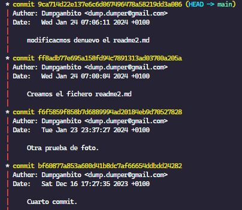

## GITHUB https://www.youtube.com/watch?v=3GymExBkKjE&t=2537s

Punto de retorno : 00:57:48 | 10 - "git checkout" y "git reset"

- Control de Versiones Distribuidos (DVCS)

### **CONFIGURACION INICIAL**

git config --global user.name "<nombre_usuario>"
git config --global user.email "<email>"

### **1) Empezar el proyecto:**

    git init  -> Crea un carpeta oculta .git donde guarda toda la configuración.

### **2) Cambiar la rama de nombre:**

**_Estando en la rama donde quiere cambiarse el nombre:_**

git branch -m <nombre_nuevo_para_la_rama>

git branch: Este es el comando básico para trabajar con ramas en Git.
-m: Es la opción que se utiliza para cambiar el nombre de la rama.

Otra forma de cambiar el nombre de la rama principal:

```terminal
    git config --global init.defaultBranch <name>
```

### **3) Estado del proyecto:**

git status

### **4. Hacer fotos de ficheros.**

- git add <nombre_del_fichero>
- git add . -> Todos los ficheros ( no es recomendable)

### **5. Salvar foto de los ficheros.**

git commit -m " < mensaje > "

git commit: Este comando se utiliza para confirmar los cambios realizados en el área de preparación y agregarlos al historial de versiones del repositorio.

La opción -m se utiliza para proporcionar un mensaje de confirmación en línea con el comando. El mensaje entre comillas ("Mi primer commit") es un comentario que describe brevemente los cambios realizados en este commit. Es una buena práctica escribir mensajes descriptivos y significativos para que otros desarrolladores (o tú mismo en el futuro) puedan entender fácilmente el propósito del commit.

Cuando se realiza una fotografía, git le asigna un HASH ( código único de identificación).

### **6. Ver los commits realizados:**

#### **_git log_**


#### **_git log --graph_**



#### **_git log --graph --pretty=oneline_**


### \*\*7. Volver a un estado anterior sin haber hecho commit.

git checkout

### **Alias**

```javascript
git config --global alias.<nombreDelAlias> "log --graph --onelilne --decorate --all"
```

1. git --global alias.tree "log --graph --decorate --all --oneline"
2. git tree


